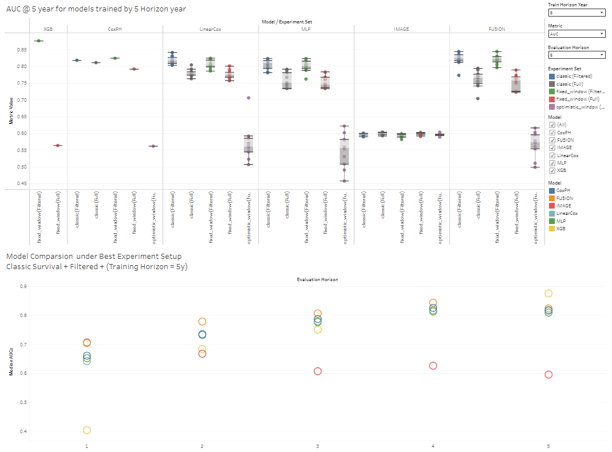

# Predicting Progression to Chronic Pancreatitis  
End-to-end survival modeling & analysis of longitudinal clinical and imaging data

## Overview
This repository contains the full codebase for a capstone project on predicting
progression to **chronic pancreatitis (CP)** after the first **acute pancreatitis (AP)** using longitudinal clinical data
and CT imaging. The project integrates large-scale data preprocessing, image
feature extraction, and survival modeling to evaluate disease risk under
multiple experimental configurations.

The pipeline is organized into **four sequential stages**, each implemented
in a dedicated folder.

## Interactive Results Dashboard

An interactive Tableau dashboard summarizing survival model performance across
prediction horizons (1–5 years) is available below.

🔗 **Explore the interactive dashboard:**  
https://public.tableau.com/views/SurvivalModelsEvaluatedAcrossPredictionHorizons15Years/Dashboard1

## Project Documentation
- Final project report: `capstone_complete_report.pdf`

## Contributors
- Yicen Yang
- Yujia Zhang
- Haoying Xu
- Haojie Yin

## Repository Structure & Pipeline Stages

### Step 1 — Raw Clinical Data Preprocessing  
📁 `step1_raw_clinical_preprocess`

This step processes raw clinical records to construct a clean, analysis-ready
dataset. Key operations include:
- Filtering ineligible patients
- Standardizing clinical variables
- Constructing time-to-event and observation-time fields
- Preparing labels for downstream survival analysis

---

### Step 2 — Raw Image Data Preprocessing  
📁 `step2_raw_image_preprocess`

This step handles large-scale preprocessing of raw CT imaging data:
- Extraction of DICOM metadata and imaging data
- Conversion of RGB images to grayscale
- Reduction of multi-frame images to representative 2D slices
- Compression of imaging data using BLOSC (LZ4HC + bitshuffle) for storage efficiency
- Parallelized processing across dataset shards

---

### Step 3 — Image Feature Extraction & Image-Only Modeling  
📁 `step3_image_pipeline`

This step focuses on CT image filtering, representation learning, and
image-only modeling:
- Identification and retention of anatomically relevant CT slices
- Sampling strategies to handle thousands of slices per patient
- Feature extraction using a pretrained SAM-Med2D encoder
- Transformer-based aggregation of slice-level embeddings
- Training and evaluation of image-only predictive models

Outputs from this step include patient-level image embeddings used by the final
survival models.

---

### Step 4 — Final Survival Analysis & Experiment Comparison  
📁 `step4_final_survival_pipeline`

This step integrates clinical features and image embeddings into a unified
survival modeling framework:
- Supports clinical-only, image-only, and fusion models
- Evaluates multiple labeling strategies:
  - classic_survival
  - fixed_window_survival
  - optimistic_window_survival
- Compares controlled vs. uncontrolled experimental settings
- Analyzes performance across prediction horizons (1–5 years)
- Produces final evaluation tables, figures, and comparative analyses

This stage contains the final survival pipeline and analysis notebooks used
to generate the project’s reported results.

---

## Data Availability & Privacy Notice

⚠️ **Important**

Due to patient privacy protections and institutional data-use restrictions,
**no clinical data, imaging data, or patient identifiers related files
are included in this repository**.

All code is provided **for methodological demonstration and review purposes
only**. Running the full pipeline requires access to the original protected
datasets.

---

## Intended Use

This repository is intended for:
- Reviewing pipeline design and implementation
- Understanding experimental setup and survival analysis methodology
- Demonstrating applied data science and machine learning work on real-world
  medical data

It is **not intended as a runnable benchmark without the original datasets**.

